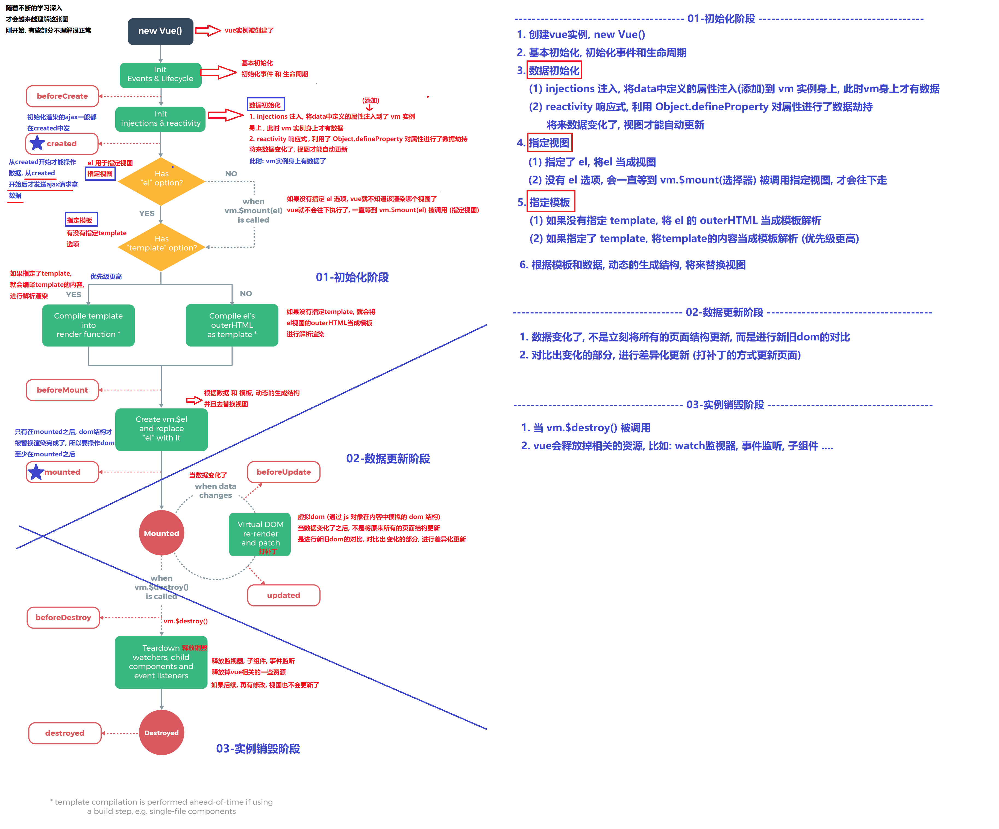

<table>
        <thead>
            <tr>
                <th>生命周期钩子</th>
                <th>组件状态</th>
                <th>最佳实践</th>
            </tr>
        </thead>
        <tbody>
            <tr>
                <td>beforeCreate</td>
                <td>实例初始化之后，this指向创建的实例，不能访问到data、computed、watch、methods上的方法和数据</td>
                <td>常用于初始化非响应式变量</td>
            </tr>
            <tr>
                <td>created</td>
                <td>实例创建完成，可访问data、computed、watch、methods上的方法和数据，未挂载到DOM，不能访问到$el属性，$ref属性内容为空数组</td>
                <td>常用于简单的ajax请求，页面的初始化</td>
            </tr>
            <tr>
                <td>beforeMount</td>
                <td>在挂载开始之前被调用，beforeMount之前，会找到对应的template，并编译成render函数</td>
                <td>–</td>
            </tr>
            <tr>
                <td>mounted</td>
                <td>实例挂载到DOM上，此时可以通过DOM API获取到DOM节点，$ref属性可以访问</td>
                <td>常用于获取VNode信息和操作，ajax请求</td>
            </tr>
            <tr>
                <td>beforeupdate</td>
                <td>响应式数据更新时调用，发生在虚拟DOM打补丁之前</td>
                <td>适合在更新之前访问现有的DOM，比如手动移除已添加的事件监听器</td>
            </tr>
            <tr>
                <td>updated</td>
                <td>虚拟 DOM 重新渲染和打补丁之后调用，组件DOM已经更新，可执行依赖于DOM的操作</td>
                <td>避免在这个钩子函数中操作数据，可能陷入死循环</td>
            </tr>
            <tr>
                <td>beforeDestroy</td>
                <td>实例销毁之前调用。这一步，实例仍然完全可用，this仍能获取到实例</td>
                <td>常用于销毁定时器、解绑全局事件、销毁插件对象等操作</td>
            </tr>
            <tr>
                <td>destroyed</td>
                <td>实例销毁后调用，调用后，Vue 实例指示的所有东西都会解绑定，所有的事件监听器会被移除，所有的子实例也会被销毁</td>
                <td>–</td>
            </tr>
        </tbody>
    </table>